<div align="center">


</div>

---

<div align="center">

# Abdul Ahad 

### `Data Engineer` • `Big Data Architect` • `Cloud Data Specialist`


<br><br>


</div>

---

# 🧠 ABOUT ME


```yaml id="f34k0c"
name: Abdul Ahad

role: Senior Data Engineer

specialization:
  - Data Engineering
  - Big Data Processing
  - Distributed Systems
  - Cloud Architecture
  - ETL / ELT Pipelines
  - Real-Time Streaming

currently_working_on:
  - Lakehouse Architecture
  - Spark Optimization
  - Data Platform Engineering

interests:
  - Scalable Systems
  - Cloud Computing
  - Data Infrastructure
  - Workflow Automation
  - Analytics Engineering

philosophy:
  "Transforming raw data into intelligent systems."
````

<br clear="right"/>

---

# ⚔️ TECH ARSENAL

<div align="center">

## 🚀 LANGUAGES


---

## ⚡ DATA ENGINEERING STACK


---

## ☁️ CLOUD & DEVOPS


---

## 🛢️ DATABASES & WAREHOUSES


</div>

---

# 🏗️ DATA ENGINEERING ECOSYSTEM

```mermaid id="9wz2k1"
flowchart LR

A[APIs / Databases / Logs] --> B[Kafka Streaming]
B --> C[Spark Processing]
C --> D[Airflow Orchestration]
D --> E[ETL / ELT Pipelines]
E --> F[Snowflake / Data Lake]
F --> G[Analytics / BI]

style A fill:#000000,color:#00F7FF,stroke:#00F7FF
style B fill:#111111,color:#00F7FF,stroke:#00F7FF
style C fill:#000000,color:#00F7FF,stroke:#00F7FF
style D fill:#111111,color:#00F7FF,stroke:#00F7FF
style E fill:#000000,color:#00F7FF,stroke:#00F7FF
style F fill:#111111,color:#00F7FF,stroke:#00F7FF
style G fill:#000000,color:#00F7FF,stroke:#00F7FF
```

<div align="center">



</div>

---

# 📊 GITHUB ANALYTICS

<div align="center">


<br><br>


<br><br>


</div>

---

# ⚡ CORE EXPERTISE

<div align="center">

| Domain             | Expertise                        |
| ------------------ | -------------------------------- |
| ⚡ Data Engineering | ETL, ELT, Batch Processing       |
| 🚀 Big Data        | Spark, PySpark, Hadoop           |
| 🔥 Streaming       | Kafka, Real-Time Pipelines       |
| ☁️ Cloud           | AWS, Azure, Cloud Architecture   |
| 🛢️ Warehousing    | Snowflake, BigQuery, Redshift    |
| 📊 Analytics       | dbt, Data Modeling               |
| 🔄 Orchestration   | Airflow, Workflow Automation     |
| 🐳 DevOps          | Docker, Kubernetes, CI/CD        |
| 🔐 Infrastructure  | Terraform, Linux                 |
| 📈 Performance     | Query Optimization, Spark Tuning |

</div>

---

# 🧬 CURRENT FOCUS

```python id="h0z6sy"
class DataEngineer:

    def __init__(self):
        self.name = "Your Name"
        self.role = "Senior Data Engineer"
        self.skills = [
            "Python",
            "PySpark",
            "Kafka",
            "Airflow",
            "Snowflake",
            "Databricks",
            "AWS",
            "Azure"
        ]

    def build_pipeline(self):
        return "Scalable & Fault-Tolerant Data Pipeline"

    def mindset(self):
        return "Automate Everything 🚀"

me = DataEngineer()

print(me.build_pipeline())
print(me.mindset())
```

---

# 🌐 CONNECT WITH ME

<div align="center">

<a href="https://linkedin.com/in/YOUR_LINKEDIN">

</a>

<a href="https://github.com/YOUR_USERNAME">

</a>

<a href="mailto:yourmail@gmail.com">

</a>

<a href="https://twitter.com/YOUR_HANDLE">

</a>

</div>

---

# 🐍 CONTRIBUTION SNAKE

<div align="center">


</div>

---

# 💀 NIGHT MODE ACTIVATED

<div align="center">


</div>
```
