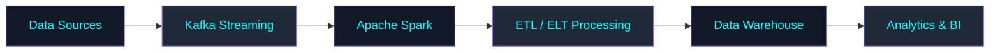

Here’s a complete premium-style `README.md` for your GitHub profile — designed for a **Data Engineer** with a modern dark aesthetic, animated badges, typing animation, GitHub stats, tech stack, tools, cloud ecosystem, and professional sections.

````md
<!-- ========================================= -->
<!--            GITHUB PROFILE README          -->
<!-- ========================================= -->

<h1 align="center">Hi 👋, I'm Your Name</h1>

<h3 align="center">
🚀 Data Engineer | Cloud & Big Data Enthusiast | ETL/ELT Specialist
</h3>

<p align="center">
  
</p>

---

# 💫 About Me

```yaml
Name: Your Name
Role: Data Engineer
Focus:
  - Data Pipelines
  - Big Data Processing
  - Cloud Data Engineering
  - Data Warehousing
  - Real-time Streaming
  - ETL & ELT Automation

Currently Learning:
  - Advanced Spark Optimization
  - Data Lakehouse Architecture
  - Kubernetes for Data Engineering

Passionate About:
  - Scalable Systems
  - Data Architecture
  - Workflow Automation
  - Cloud Engineering
````

---

# 🌌 Tech Stack

## 🧠 Programming & Query Languages

<p align="left">
  
  
  
</p>

---

## ⚡ Data Engineering Tools

<p align="left">
  
  
  
  
  
  
  
</p>

---

## ☁️ Cloud & DevOps

<p align="left">
  
</p>

---

## 🛢️ Databases & Warehouses

<p align="left">
  
  
  
</p>

---

# 🚀 Core Expertise

✅ ETL & ELT Pipelines
✅ Data Warehousing
✅ Real-time Data Streaming
✅ Workflow Orchestration
✅ Distributed Data Processing
✅ Cloud-Native Data Solutions
✅ Data Modeling
✅ Batch & Streaming Architecture
✅ Data Lake & Lakehouse Architecture
✅ CI/CD for Data Pipelines
✅ Data Governance & Optimization
✅ Monitoring & Logging

---

# 📊 GitHub Analytics

<p align="center">
  

  
</p>

---

# 🔥 GitHub Streak

<p align="center">
  
</p>

---

# 📈 Contribution Graph

<p align="center">
  
</p>

---

# 🏗️ Data Engineering Workflow



---

# 🌍 Connect With Me

<p align="left">
<a href="https://linkedin.com/in/YOUR_LINKEDIN" target="blank">

</a>

<a href="https://github.com/YOUR_USERNAME" target="blank">

</a>

<a href="mailto:yourmail@gmail.com">

</a>
</p>

---

# ⚡ Fun Fact

```python
while alive:
    eat()
    sleep()
    engineer_data()
    repeat()
```

---

<p align="center">

### 🚀 "Data is the new oil, but engineering is the refinery."


</p>
```
